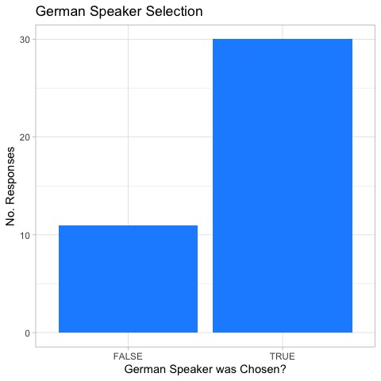
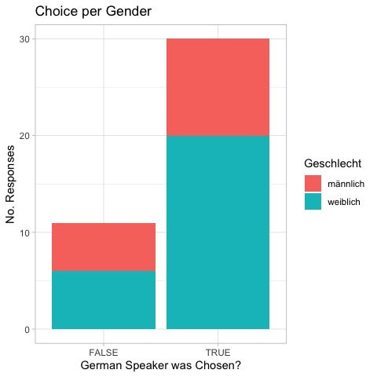
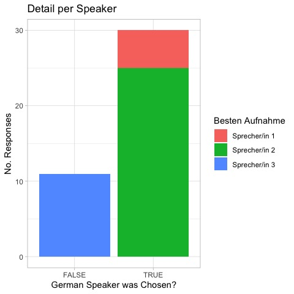
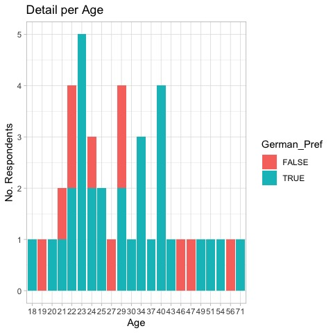
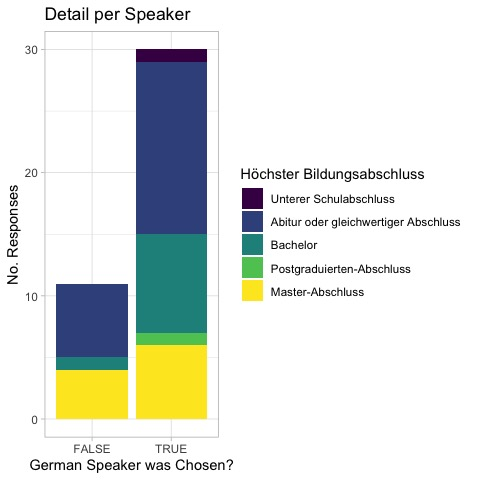
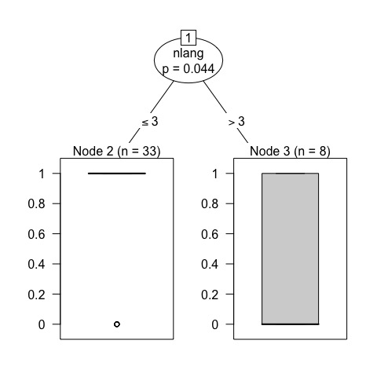
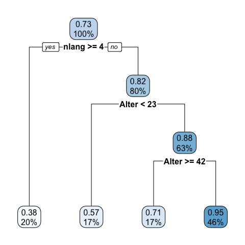

  

# Attitudes of native German speakers towards accents of bilingual speakers in German
Results from a Survey Made to some German speakers in a class of Research Methods for English Linguistics. The project was made with 4 more students who collaborated with the design of the Survey and the Experiment. 

----
## Project Description

As we wanted to understand if there was any bias in how the German speakers perceived accents from non-native speakers, we decided to record 4 people reading the same text which was then listened by German Speakers to judge their perceptions of the readers. The group of readers was made of 2 women and 2 men: one native German Speaker and one non-native German Speaker for each Gender. 

All the recordings and the perceptions were gathered through [this survey] that was feeding a Google Sheets file that at the same time was being read in real time by [this dashboard] made by me in Google Looker Studio. It contains a summary of the results from the survey respondents.

Done that, a more precise review was made in form of an R Markdown file as shown here:

----


## Loading the Dataset

``` r
library(googlesheets4)
dataset <- read_sheet('https://docs.google.com/spreadsheets/d/1G5XRN7adCeNlLVsgSiH3Cu2_6h2LXzZarpfgcMiBhWg/edit#gid=1392778802',sheet='Final')
```

    ## ! Using an auto-discovered, cached token.

    ## ✔ Reading from "Survey Results".

    ## ✔ Range ''Final''.

``` r
dataset
```

    ## # A tibble: 6,440 × 27
    ##    Submission          Ich bestätige, dass ich die oben…¹ Ich erkläre mich dam…²
    ##    <dttm>              <chr>                              <chr>                 
    ##  1 2023-01-09 11:09:45 Ja                                 Ja                    
    ##  2 2023-01-09 11:09:45 Ja                                 Ja                    
    ##  3 2023-01-09 11:09:45 Ja                                 Ja                    
    ##  4 2023-01-09 11:09:45 Ja                                 Ja                    
    ##  5 2023-01-09 11:09:45 Ja                                 Ja                    
    ##  6 2023-01-09 11:09:45 Ja                                 Ja                    
    ##  7 2023-01-09 11:09:45 Ja                                 Ja                    
    ##  8 2023-01-09 11:09:45 Ja                                 Ja                    
    ##  9 2023-01-09 11:09:45 Ja                                 Ja                    
    ## 10 2023-01-09 11:09:45 Ja                                 Ja                    
    ## # ℹ 6,430 more rows
    ## # ℹ abbreviated names:
    ## #   ¹​`Ich bestätige, dass ich die oben genannten Informationen für Teilnehmer gelesen und versta...`,
    ## #   ²​`Ich erkläre mich damit einverstanden, an einem sprachwissenschaftlichen Forschungsprojekt ...`
    ## # ℹ 24 more variables:
    ## #   `Mir ist bekannt, dass ich meine Daten jederzeit und ohne Angabe von Gründen zurückziehen k...` <chr>,
    ## #   `Ich bin damit einverstanden, dass meine Antworten zu Forschungszwecken verwendet werden dü...` <chr>, …

``` r
df <- dataset[which(!is.na(dataset$Alter)),]
df <- df[which(df$Muttersprache=="Deutsch"),]
cols <- c('Name','Alter','Geschlecht','Geburtsort','Höchster Bildungsabschluss','Fach','Beruf','Muttersprache','Besten Aufnahme','Charaktereigenschaften','Aufnahme','Score','Sprache 1','Level 1','Sprache 2','Level 2','Sprache 3','Level 3','Sprache 4','Level 4')
df <- df[cols]
df['nlang'] <- 4 - is.na(df$`Sprache 1`) - is.na(df$`Sprache 2`) - is.na(df$`Sprache 3`) - is.na(df$`Sprache 4`)
df$Charaktereigenschaften <- as.factor(df$Charaktereigenschaften)
df$Geschlecht <- as.factor(df$Geschlecht)
df$Muttersprache <- as.factor(df$Muttersprache)
df$`Höchster Bildungsabschluss` <- factor(df$`Höchster Bildungsabschluss`,ordered = TRUE, 
                                          levels = c("Unterer Schulabschluss", "Abitur oder gleichwertiger Abschluss","Bachelor","Postgraduierten-Abschluss","Master-Abschluss","Doktorat"))
df['German_Pref'] <- (df$`Besten Aufnahme`=="Sprecher/in 1" | df$`Besten Aufnahme`=="Sprecher/in 2")
df$German_Pref_01 <- as.numeric(as.factor(df$German_Pref))-1
df$`Besten Aufnahme` <- as.factor(df$`Besten Aufnahme`)
df
```

    ## # A tibble: 2,460 × 23
    ##    Name  Alter Geschlecht Geburtsort  `Höchster Bildungsabschluss`   Fach  Beruf
    ##    <chr> <dbl> <fct>      <chr>       <ord>                          <chr> <chr>
    ##  1 Jan T    21 männlich   Deutschland Abitur oder gleichwertiger Ab… <NA>  <NA> 
    ##  2 Jan T    21 männlich   Deutschland Abitur oder gleichwertiger Ab… <NA>  <NA> 
    ##  3 Jan T    21 männlich   Deutschland Abitur oder gleichwertiger Ab… <NA>  <NA> 
    ##  4 Jan T    21 männlich   Deutschland Abitur oder gleichwertiger Ab… <NA>  <NA> 
    ##  5 Jan T    21 männlich   Deutschland Abitur oder gleichwertiger Ab… <NA>  <NA> 
    ##  6 Jan T    21 männlich   Deutschland Abitur oder gleichwertiger Ab… <NA>  <NA> 
    ##  7 Jan T    21 männlich   Deutschland Abitur oder gleichwertiger Ab… <NA>  <NA> 
    ##  8 Jan T    21 männlich   Deutschland Abitur oder gleichwertiger Ab… <NA>  <NA> 
    ##  9 Jan T    21 männlich   Deutschland Abitur oder gleichwertiger Ab… <NA>  <NA> 
    ## 10 Jan T    21 männlich   Deutschland Abitur oder gleichwertiger Ab… <NA>  <NA> 
    ## # ℹ 2,450 more rows
    ## # ℹ 16 more variables: Muttersprache <fct>, `Besten Aufnahme` <fct>,
    ## #   Charaktereigenschaften <fct>, Aufnahme <dbl>, Score <dbl>,
    ## #   `Sprache 1` <chr>, `Level 1` <chr>, `Sprache 2` <chr>, `Level 2` <chr>,
    ## #   `Sprache 3` <chr>, `Level 3` <chr>, `Sprache 4` <chr>, `Level 4` <chr>,
    ## #   nlang <dbl>, German_Pref <lgl>, German_Pref_01 <dbl>

``` r
cols_r <- c('Name','Alter','Geschlecht','Geburtsort','Höchster Bildungsabschluss','Fach','Beruf','Muttersprache','Besten Aufnahme','nlang','German_Pref','German_Pref_01')
df_reduced <- df[cols_r]
df_reduced <- df_reduced[!duplicated(df_reduced$Name),]
df_reduced
```

    ## # A tibble: 41 × 12
    ##    Name      Alter Geschlecht Geburtsort  Höchster Bildungsabschlu…¹ Fach  Beruf
    ##    <chr>     <dbl> <fct>      <chr>       <ord>                      <chr> <chr>
    ##  1 Jan T        21 männlich   Deutschland Abitur oder gleichwertige… <NA>  <NA> 
    ##  2 Maya R.      22 weiblich   Deutschland Bachelor                   Biol… <NA> 
    ##  3 Denise N.    25 weiblich   <NA>        Abitur oder gleichwertige… <NA>  Cust…
    ##  4 Omisha B     21 weiblich   Deutschland Abitur oder gleichwertige… <NA>  <NA> 
    ##  5 Gesa T.      25 weiblich   Deutschland Master-Abschluss           Nach… Stel…
    ##  6 Pia R.       24 weiblich   Deutschland Abitur oder gleichwertige… <NA>  <NA> 
    ##  7 Alicia H.    22 weiblich   <NA>        Abitur oder gleichwertige… <NA>  <NA> 
    ##  8 Julia K.     23 weiblich   Deutschland Abitur oder gleichwertige… <NA>  <NA> 
    ##  9 Anna E.      23 weiblich   <NA>        Bachelor                   Land… <NA> 
    ## 10 Lukas V.     23 männlich   Deutschland Abitur oder gleichwertige… <NA>  Stud…
    ## # ℹ 31 more rows
    ## # ℹ abbreviated name: ¹​`Höchster Bildungsabschluss`
    ## # ℹ 5 more variables: Muttersprache <fct>, `Besten Aufnahme` <fct>,
    ## #   nlang <dbl>, German_Pref <lgl>, German_Pref_01 <dbl>

``` r
library(ggplot2)
ggplot(df_reduced, aes(x=German_Pref))+
    geom_bar(fill="dodgerblue")+
    labs(title="German Speaker Selection", x = "German Speaker was Chosen?", y = "No. Responses")+
    theme_light()
```

<!-- -->

``` r
library(ggplot2)
ggplot(df_reduced, aes(x=German_Pref, fill=Geschlecht))+
    geom_bar()+
    labs(title="Choice per Gender", x = "German Speaker was Chosen?", y = "No. Responses")+
    theme_light()
```

<!-- -->

``` r
ggplot(df_reduced, aes(x=German_Pref, fill=`Besten Aufnahme`))+
    geom_bar()+
    labs(title="Detail per Speaker", x = "German Speaker was Chosen?", y = "No. Responses")+
    theme_light()
```

<!-- -->

``` r
ggplot(df_reduced, aes(x=as.factor(Alter), fill = German_Pref))+
    geom_bar()+
    labs(title="Detail per Age", x = "Age", y = "No. Respondents")+
    theme_light()
```

<!-- -->

``` r
ggplot(df_reduced, aes(x=German_Pref, fill=`Höchster Bildungsabschluss`))+
    geom_bar()+
    labs(title="Detail per Speaker", x = "German Speaker was Chosen?", y = "No. Responses")+
    theme_light()
```

<!-- -->

``` r
library(party)
```

    ## Loading required package: grid

    ## Loading required package: mvtnorm

    ## Loading required package: modeltools

    ## Loading required package: stats4

    ## Loading required package: strucchange

    ## Loading required package: zoo

    ## 
    ## Attaching package: 'zoo'

    ## The following objects are masked from 'package:base':
    ## 
    ##     as.Date, as.Date.numeric

    ## Loading required package: sandwich

``` r
tree <- ctree(`German_Pref` ~  Alter + nlang + Geschlecht + `Höchster Bildungsabschluss`, data = df_reduced)
tree
```

    ## 
    ##   Conditional inference tree with 2 terminal nodes
    ## 
    ## Response:  German_Pref 
    ## Inputs:  Alter, nlang, Geschlecht, Höchster Bildungsabschluss 
    ## Number of observations:  41 
    ## 
    ## 1) nlang <= 3; criterion = 0.956, statistic = 6.433
    ##   2)*  weights = 33 
    ## 1) nlang > 3
    ##   3)*  weights = 8

``` r
plot(tree)
```

<!-- -->

``` r
library(rpart)
library(rpart.plot)
tree <- rpart(`German_Pref` ~  Alter + nlang + Geschlecht + `Höchster Bildungsabschluss`, data = df_reduced)
tree
```

    ## n= 41 
    ## 
    ## node), split, n, deviance, yval
    ##       * denotes terminal node
    ## 
    ##  1) root 41 8.0487800 0.7317073  
    ##    2) nlang>=3.5 8 1.8750000 0.3750000 *
    ##    3) nlang< 3.5 33 4.9090910 0.8181818  
    ##      6) Alter< 22.5 7 1.7142860 0.5714286 *
    ##      7) Alter>=22.5 26 2.6538460 0.8846154  
    ##       14) Alter>=41.5 7 1.4285710 0.7142857 *
    ##       15) Alter< 41.5 19 0.9473684 0.9473684 *

``` r
rpart.plot(tree)
```

<!-- -->

``` r
printcp(tree)
```

    ## 
    ## Regression tree:
    ## rpart(formula = German_Pref ~ Alter + nlang + Geschlecht + `Höchster Bildungsabschluss`, 
    ##     data = df_reduced)
    ## 
    ## Variables actually used in tree construction:
    ## [1] Alter nlang
    ## 
    ## Root node error: 8.0488/41 = 0.19631
    ## 
    ## n= 41 
    ## 
    ##         CP nsplit rel error xerror    xstd
    ## 1 0.157128      0   1.00000 1.0823 0.17608
    ## 2 0.067210      1   0.84287 1.0250 0.20466
    ## 3 0.034528      2   0.77566 1.0862 0.23474
    ## 4 0.010000      3   0.74113 1.1715 0.24606

``` r
an <- anova(glm(`German_Pref` ~  Alter + nlang + Geschlecht + `Höchster Bildungsabschluss`-1, data=df_reduced))
an
```

    ## Analysis of Deviance Table
    ## 
    ## Model: gaussian, link: identity
    ## 
    ## Response: German_Pref
    ## 
    ## Terms added sequentially (first to last)
    ## 
    ## 
    ##                              Df Deviance Resid. Df Resid. Dev
    ## NULL                                            41    30.0000
    ## Alter                         1  19.6323        40    10.3677
    ## nlang                         1   0.0149        39    10.3528
    ## Geschlecht                    2   3.8390        37     6.5138
    ## `Höchster Bildungsabschluss`  4   0.4732        33     6.0405
